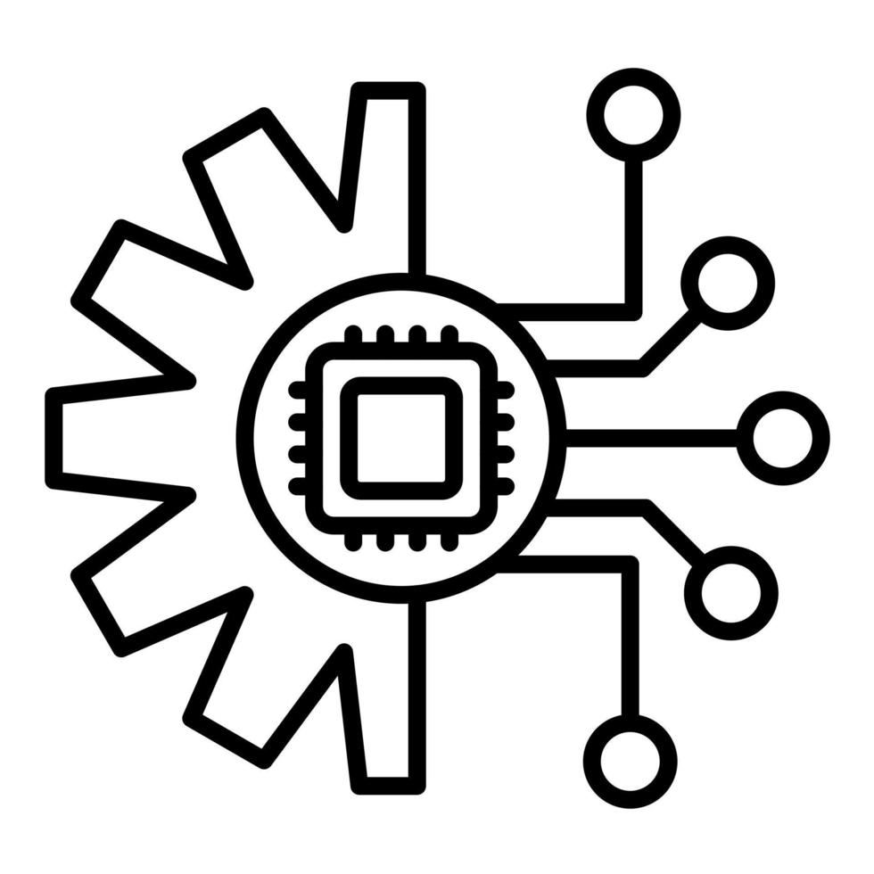

<p align="center">
  
</p>

<h1 align="center">CIrcLe — Advanced Threat Operations</h1>

<p align="center">
  
  
  
  
</p>

## 🌐 Overview
**CIrcLe** (formerly SecureEdge) is a state-of-the-art WebGL powered cybersecurity dashboard. Designed for high-fidelity situational awareness, it transforms raw network traffic analytics into a fully interactive 3D command center.

<p align="center">
  
</p>

## ⚡ Core Systems Architecture

### 1. 3D WebGL Network Mapping
Built top-to-bottom using `@react-three/fiber` and `@react-three/drei`. The engine renders the central Core Router and dynamic edge nodes, utilizing custom Bloom post-processing to achieve the glowing cyberpunk aesthetic. Nodes breathe, pulse, and physically react to network traffic latency.

### 2. Live Threat Intelligence (Defense Matrix)
An interactive Security Operations Center (SOC) panel that allows operators to enforce live rules:
- **Intrusion Prevention (IDS/IPS)**: Set to *Aggressive* to enable Active Auto-Remediation timeouts.
- **Firewall Rules**: Switch between *Permissive*, *Default Block*, *Zero-Trust*, and *Lockdown*.
- **Volumetric Shielding**: Enable *Always-On* DDoS mitigation to automatically absorb attacks.
- **Geo-Fencing**: Configure global IP isolation.

### 3. Asynchronous Terminal Interface
An integrated OS-level terminal simulation built with `framer-motion` for drag-and-drop kinetics. Includes custom recursive parsers mimicking genuine network commands:
- `nmap [ip]`: Executes a simulated port discovery.
- `ping [ip]`: Streams simulated ICMP echo replies.
- `whois [domain]`: Pulls mock registration data.
- `traceroute [ip]`: Simulates network hop latency.
- `reset`: Flushes all SOC alerts and restores the 3D grid.

## 🚀 Installation & Build Guide

### Prerequisites
- Python 3.10+
- Node.js v15+

### Initialization
To run the full stack locally, launch the data engine and the WebGL renderer simultaneously.

```bash
# 1. Start the Python State Engine
cd backend
python -m venv venv
# Windows: venv\Scripts\activate | Unix: source venv/bin/activate
pip install -r requirements.txt
python app.py

# 2. Start the WebGL Frontend Client
cd frontend
npm install
npm run dev
```

## 🛡️ Dynamic Response Engine
The backend engine (Flask) monitors the **Defense Matrix** state. If a threat enters the system while the Matrix enforces `Zero-Trust`, the backend instantly overrides standard trust protocols, drops the payload's score to critical, and commands the Three.js renderer to paint the node red and pulse aggressively. It is a fully closed-loop reactive pipeline built for visual storytelling.

## 🎯 The Problem
Historically, demonstrating complex cybersecurity concepts—such as Zero-Trust architectures, volumetric DDoS mitigation, and Intrusion Prevention Systems—required deploying heavy, expensive, and fragile physical hardware arrays. Presentations relied on static slideshows or simulated terminal text, which failed to convey the real-time, dynamic nature of network topography and active threat response. This gap made it difficult for stakeholders and students to grasp the severity and mechanics of cyber attacks.

## ✅ Present Benefits
**CIrcLe** solves this by delivering a completely self-contained, high-fidelity mock SOC environment that runs locally on any machine.
- **Zero Infrastructure Cost**: Replaces the need for physical enterprise hardware (like Cisco ISE or pfSense) for conceptual demonstrations.
- **Immediate Visual Feedback**: Abstracts complex packet-filtering rules into beautiful 3D WebGL visualizations, proving how security policies affect network nodes in real-time.
- **Risk-Free Sandboxing**: Provides a completely isolated, simulated environment to train analysts on threat identification, terminal diagnostics (nmap, ping), and rapid-response mitigation without risking live enterprise data.

## 🔭 Future Scope
The ultimate vision for CIrcLe extends beyond mock demonstrations:
- **Live SIEM Integration**: Connecting the Flask data engine to real-world pipelines (e.g., Splunk, ELK stack) to ingest and visualize genuine network traffic instead of simulated data.
- **AI-Driven Anomaly Detection**: Implementing machine learning models to dynamically analyze node traffic patterns and predict volumetric attacks before they fully materialize.
- **Multi-Tenant Command & Control**: Expanding the architecture to support multiple SOC operators simultaneously defending different segments of a wide-area decentralized topology.

---
*Built for the next generation of Cyber Intelligence.*